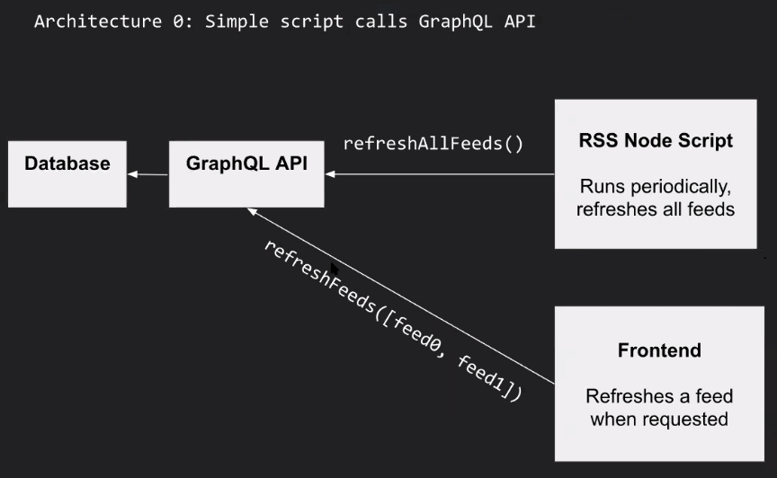
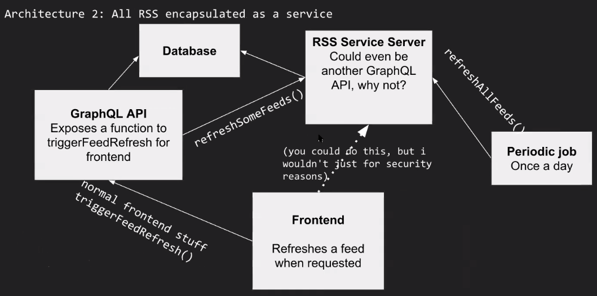

# Composite App

RSS App

## Boilerplate source

<div align="center"><strong>N</strong>ode <strong>A</strong>pollo <strong>P</strong>risma <strong>E</strong>xpress <strong>R</strong>eact <strong>G</strong>raphQL
</div>
  
<h1 align="center"><strong>Boilerplate for a Fullstack GraphQL App with React & Prisma</strong></h1>

<br />


<div align="center"><strong>🚀 Bootstrap your fullstack GraphQL app within seconds</strong></div>
<div align="center">Basic starter kit for a fullstack GraphQL app with React and Node.js - based on best practices from the GraphQL community.</div>

## Getting started

#### 1. Clone the repo to your computer

```
git clone https://github.com/akimberl/naperg rss
```

#### 2. Go the the repo

```
cd rss
```

## Server

#### 1. Install the server - # Prisma & Graphql (port 4000)

```
cd server
yarn
```

#### 2. install Postgresql database with on your local machine:

More info: [`Official PostgresQL download link`](https://www.postgresql.org/download/)

#### 3. migrate the database with `Prisma migrate` run:

More info if needed: [`Prisma Migrate`](https://www.prisma.io/docs/concepts/components/prisma-migrate)

```
npx prisma migrate dev
```

Pick a name for your first migration. Example "init"

```
> npx prisma migrate dev
Prisma schema loaded from prisma/schema.prisma
Datasource "db": Postgresql database "rss"

To reset your database if needed, use Prisma Reset.

More info if needed: [`Prisma Reset`](https://www.prisma.io/docs/concepts/components/prisma-migrate#do-not-edit-or-delete-migrations-that-have-been-applied)

```
npx prisma migrate reset --preview-feature
```

#### 3. Seed your Database

More info if needed: [`Prisma Seed`](https://www.prisma.io/docs/guides/application-lifecycle/seed-database/)

```
npx prisma db seed --preview-feature
```

A new user will be created from [`seed.ts`](https://github.com/alan345/naperg/blob/master/server/prisma/seed.ts#L6-L14) file.

- login: `admin@naperg.com`
- pass: `admin`
- role: `ADMIN`

#### 4. Check you databse with Prisma Studio

More info if needed: [`Prisma Studio`](https://www.prisma.io/docs/concepts/components/prisma-studio)

```
$ npx prisma studio
```


#### 5. Generate the prisma client

Prisma Client is an auto-generated database client that's tailored to your database schema.

More info if needed: [`Prisma Generate`](https://www.prisma.io/docs/concepts/components/prisma-client/working-with-prismaclient/generating-prisma-client)

```
npx prisma generate
```

#### 6. Start the server (http://localhost:4000)

```
yarn start
```

## Frontend

#### 1. Install the frontEnd - ReactJs (port 3000). In a new terminal run:

```sh
cd react
yarn
```

#### 2. Start the frontend.

```
yarn start
```

#### 3. Go to url: http://localhost:3000

### 4. architecture

Current version: 

Future plans: 

### 5. project structure

```
├── docs // agreements and docs
├── server // backend with DB seed and APIs
└── react // frontend react app
```
## Tutorial

[](https://www.youtube.com/watch?v=KhDNp8Aw3HM)

## Features

- **Scalable GraphQL server:** The server uses [`apollo-server`](https://www.apollographql.com/docs/apollo-server/)
- **Pre-configured Apollo Client:** The project comes with a preconfigured setup for Apollo Client
- **Tooling**: Out-of-the-box support for [GraphQL Playground](https://github.com/prisma/graphql-playground)
- **Extensible**: Simple and flexible data model – easy to adjust and extend
- **Search with GraphQL**: Example to search in 2 fields for the users: Email and name
- **Signup management**:
  - Check password strength

For a fully-fledged **React & Apollo tutorial**, visit [How to GraphQL](https://www.howtographql.com/react-apollo/0-introduction/).

## Made with..

Typescript (https://www.typescriptlang.org/) for the Frontend and the Backend

Frontend:

- User interfaces: React https://reactjs.org/
- Design: material-ui-next https://material-ui.com/
- GraphQL tool: Apollo Client https://www.apollographql.com/

Backend:

- Server JS: ExpressJs https://expressjs.com/
- Server GraphQL: https://www.apollographql.com/docs/apollo-server/)
- ORM (object-relational mapping): Prisma https://www.prisma.io/
- Database PostgresQL. You can replace by the database you want (MySQL - SQLite - SQL Server). Check the prisma documentation https://www.prisma.io/docs/concepts/
